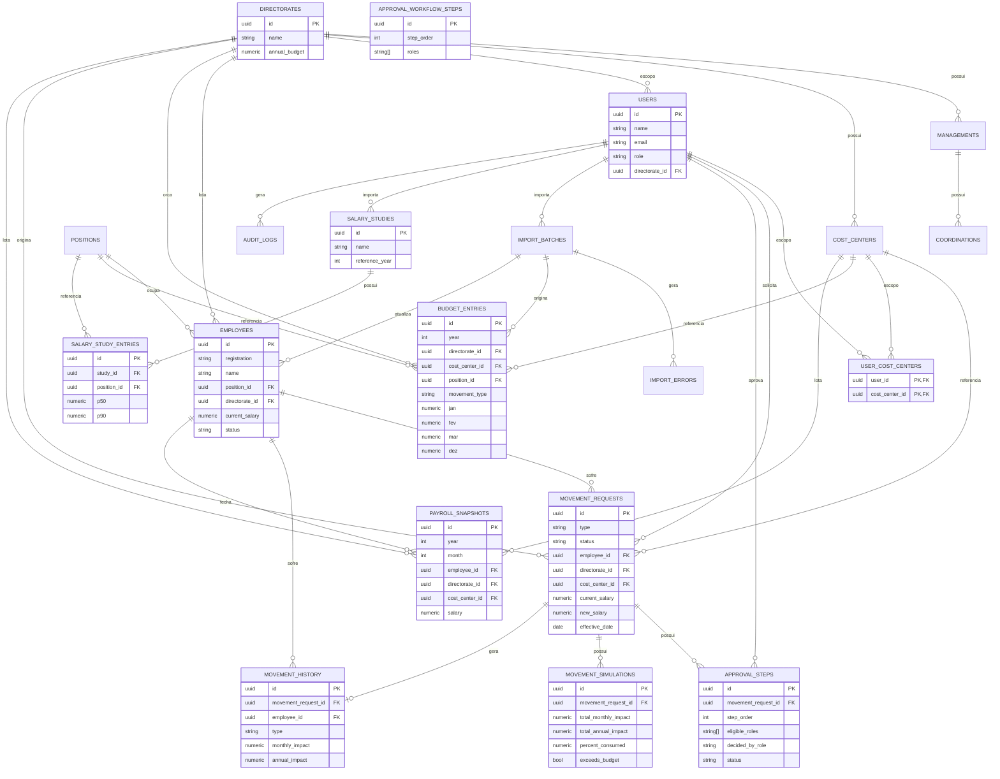

# Modelo Entidade-Relacionamento (DER)

Diagrama de referência do banco definido em `schema.sql` / `backend/src/migrations`.

## Notas de modelagem

- **Snapshot vs. referência viva**: `movement_history` guarda campos
  "achatados" (cargo, diretoria no momento do fato) além das FKs, para que
  relatórios históricos não mudem retroativamente se um cargo for renomeado
  depois.
- **`budget_entries` não é vinculada a colaborador**: o orçamento é por
  (diretoria, centro de custo, cargo, tipo de movimentação), com o custo
  orçado em 12 colunas mensais (`jan`..`dez`, nulas fora do período orçado).
  Não há matrícula/nome nem chave única — múltiplas linhas repetindo a mesma
  combinação diretoria+centro de custo+cargo+tipo representam vagas/assentos
  distintos daquele tipo (ex.: 24 linhas idênticas de "Analista I / Sem
  Movimentação" no mesmo centro de custo = 24 vagas orçadas para esse cargo).
  A comparação com a base atual de colaboradores (módulo 2) é feita
  agregando por diretoria+centro de custo (nunca por cargo) num mês de
  referência, não por matrícula — comparar por cargo faria um cargo
  estourado e outro com sobra no mesmo centro de custo aparecerem como dois
  problemas separados em vez de se cancelarem.
- **`payroll_snapshots`** é o fechamento mensal da folha (`POST
  /employees/import`, coluna `mes_de_referencia` da planilha, formato
  `MM/AAAA`): um "retrato" do salário de cada
  colaborador no mês em que a base foi fechada. `employees.current_salary` é
  um valor único e vivo — sem esse snapshot, um relatório de um mês passado
  mostraria o salário mais recente (re-importado depois) em vez do que a
  folha realmente era naquele mês. Onde existir snapshot para (year, month),
  `DashboardService`/`EmployeesService#compareWithBudget` usam o valor
  congelado; sem snapshot para o mês pedido (mês corrente ainda em aberto,
  ou histórico anterior a este recurso), caem para `current_salary` ao vivo.
  Reimportar o mesmo (year, month) substitui o snapshot anterior de cada
  colaborador (chave única `year+month+employee_id`), nunca duplica.
- **`movement_requests` é polimórfica por `type`**: os campos específicos de
  cada tipo (mérito, aumento de quadro) ficam nullable na mesma tabela para
  permitir consultas e workflow unificados; a validação de obrigatoriedade
  por tipo é feita na camada de aplicação (DTOs) e reforçada por um CHECK
  básico (promoção não pode reduzir salário). Toda linha tem um
  `cost_center_id`: herdado do colaborador em promoção/mérito, informado na
  solicitação em aumento de quadro (obrigatório, já que não há colaborador
  para derivar).
- **`user_cost_centers`**: escopo de um usuário `GESTOR` — uma seleção de
  centros de custo (em vez de uma diretoria inteira, como o `DIRETOR`, que
  usa `users.directorate_id`). Ausência de linhas = o Gestor não vê nada
  (nunca "vê tudo" por omissão).
- **`approval_workflow_steps`** é a configuração do fluxo de aprovação
  (tela Administração > Fluxo de Aprovação, só ADMIN): uma sequência de
  etapas ordenadas por `step_order`, cada uma com um conjunto de perfis
  (`roles`) — qualquer um deles decide a etapa, o que agir primeiro. Sem FK
  para nenhuma outra tabela; a tabela inteira é substituída a cada
  salvamento. `roles` é `TEXT[]` (não um enum Postgres) de propósito: a
  lista de perfis válidos é definida em `ApproverRole` (TypeScript) e pode
  mudar sem nova migration.
- **`approval_steps`** materializa, por movimentação, uma etapa por linha de
  `approval_workflow_steps` no momento da submissão (`eligible_roles` é um
  snapshot — mudar o fluxo depois não afeta solicitações já em andamento).
  Qual etapa está "ativa" é derivado dinamicamente (a de menor `step_order`
  ainda `PENDENTE`), não armazenado no status da movimentação.
  `decided_by_role` registra qual perfil, dentre os elegíveis, de fato
  decidiu — para auditoria — junto com quem aprovou/reprovou, quando e com
  qual comentário.
- **`movement_simulations`** persiste o resultado do simulador no momento da
  submissão (não é recalculado silenciosamente depois), garantindo que a
  decisão de aprovação seja auditável com os números que o aprovador viu.
- **`audit_logs`** é genérica (entity/entity_id + before/after em JSONB) para
  cobrir qualquer tabela sem precisar de uma tabela de auditoria por entidade.
