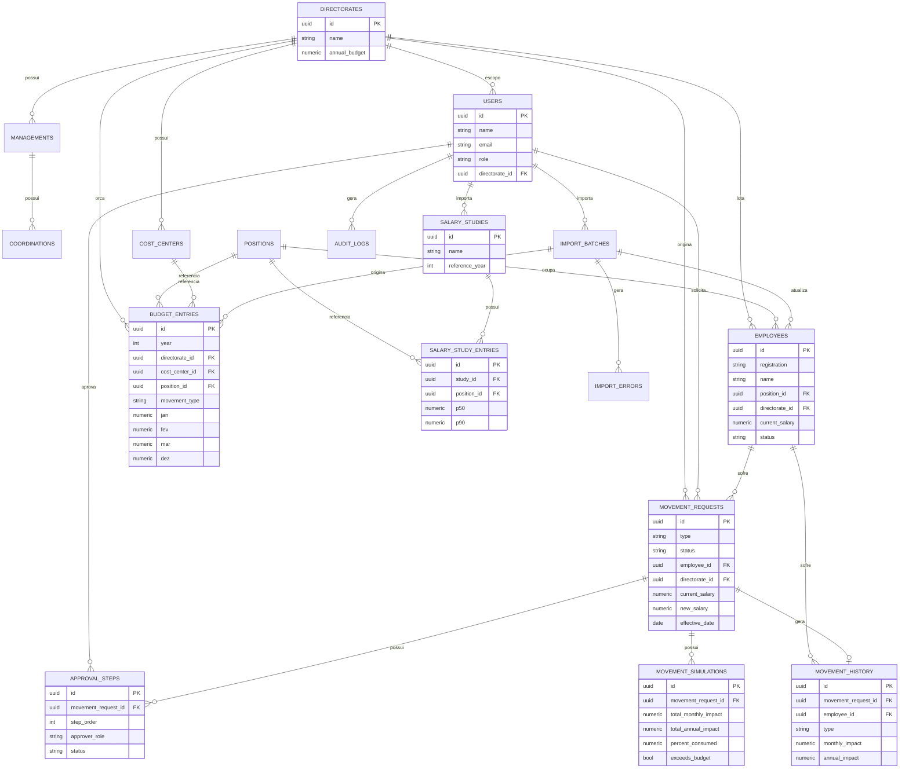

# Modelo Entidade-Relacionamento (DER)

Diagrama de referência do banco definido em `schema.sql` / `backend/src/migrations`.

## Notas de modelagem

- **Snapshot vs. referência viva**: `movement_history` guarda campos
  "achatados" (cargo, diretoria no momento do fato) além das FKs, para que
  relatórios históricos não mudem retroativamente se um cargo for renomeado
  depois.
- **`budget_entries` não é vinculada a colaborador**: o orçamento é por
  (diretoria, centro de custo, cargo, tipo de movimentação), com o custo
  orçado em 12 colunas mensais (`jan`..`dez`, nulas fora do período orçado).
  Não há matrícula/nome nem chave única — múltiplas linhas repetindo a mesma
  combinação diretoria+centro de custo+cargo+tipo representam vagas/assentos
  distintos daquele tipo (ex.: 24 linhas idênticas de "Analista I / Sem
  Movimentação" no mesmo centro de custo = 24 vagas orçadas para esse cargo).
  A comparação com a base atual de colaboradores (módulo 2) é feita
  agregando por esse mesmo bucket (diretoria+centro de custo+cargo) num mês
  de referência, não por matrícula.
- **`movement_requests` é polimórfica por `type`**: os campos específicos de cada
  tipo (mérito, transferência, aumento de quadro) ficam nullable na mesma
  tabela para permitir consultas e workflow unificados; a validação de
  obrigatoriedade por tipo é feita na camada de aplicação (DTOs) e reforçada
  por um CHECK básico (promoção não pode reduzir salário).
- **`approval_steps`** materializa o workflow Diretor → RH Remuneração →
  Financeiro como linhas ordenadas por `step_order`, permitindo auditoria de
  quem aprovou, quando e com qual comentário, além de paralelizar consultas de
  "pendências por perfil".
- **`movement_simulations`** persiste o resultado do simulador no momento da
  submissão (não é recalculado silenciosamente depois), garantindo que a
  decisão de aprovação seja auditável com os números que o aprovador viu.
- **`audit_logs`** é genérica (entity/entity_id + before/after em JSONB) para
  cobrir qualquer tabela sem precisar de uma tabela de auditoria por entidade.
